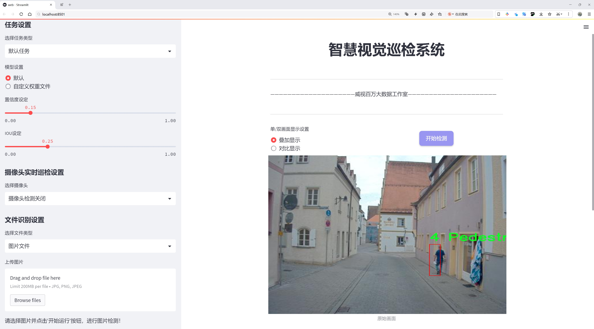
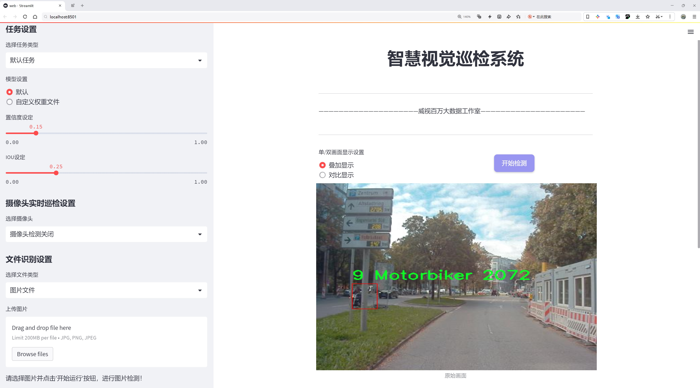
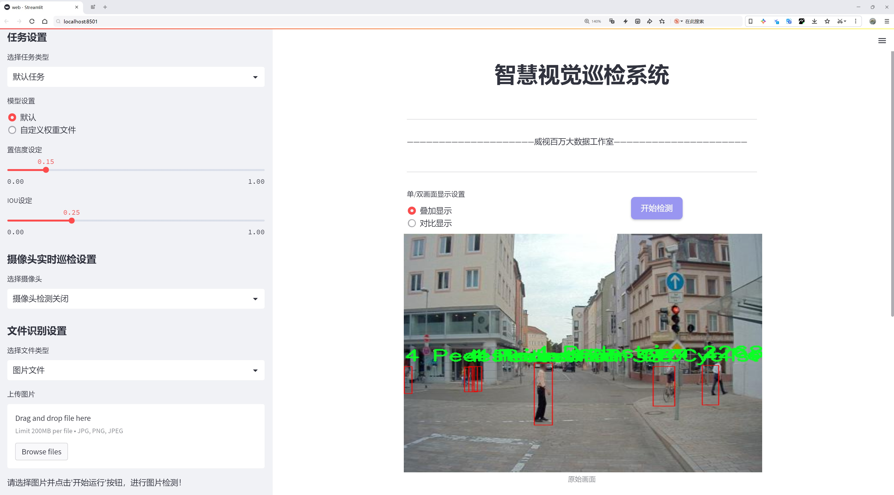
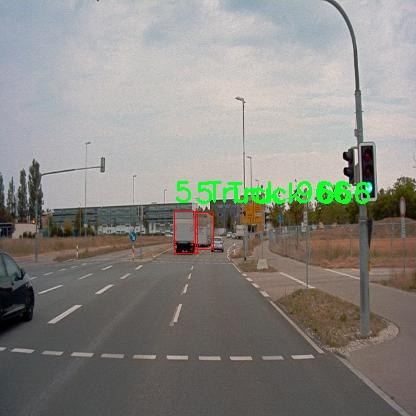
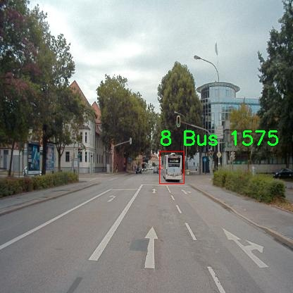
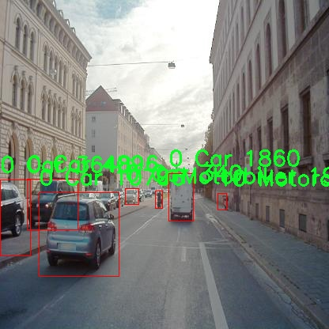
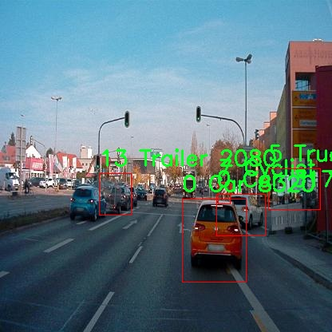
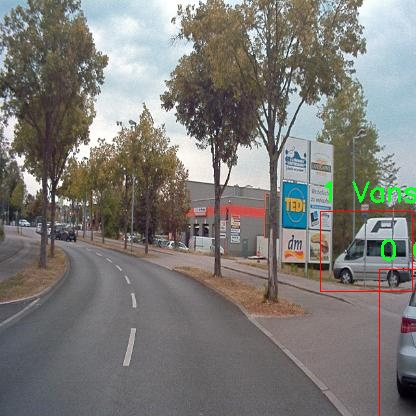

# 交通场景多目标检测检测系统源码分享
 # [一条龙教学YOLOV8标注好的数据集一键训练_70+全套改进创新点发刊_Web前端展示]

### 1.研究背景与意义

项目参考[AAAI Association for the Advancement of Artificial Intelligence](https://gitee.com/qunmasj/projects)

项目来源[AACV Association for the Advancement of Computer Vision](https://kdocs.cn/l/cszuIiCKVNis)

研究背景与意义

随着城市化进程的加快，交通流量的增加和交通场景的复杂化，交通安全问题日益突出。多目标检测技术在智能交通系统中扮演着至关重要的角色，它不仅能够实时监测交通状况，还能有效识别和分类不同类型的交通参与者，从而为交通管理和事故预防提供重要支持。近年来，深度学习技术的迅猛发展为目标检测领域带来了革命性的变化，尤其是YOLO（You Only Look Once）系列模型的提出，使得实时目标检测成为可能。YOLOv8作为该系列的最新版本，凭借其高效的检测速度和准确性，成为了多目标检测任务中的重要工具。

在交通场景中，涉及的目标种类繁多，包括汽车、卡车、摩托车、行人等，且这些目标在不同的环境和光照条件下可能表现出不同的特征。因此，构建一个高效、准确的多目标检测系统，能够适应各种复杂交通场景，显得尤为重要。为此，本研究将基于改进的YOLOv8模型，针对交通场景中的多目标检测进行深入探讨，旨在提升模型在实际应用中的性能。

本研究将采用A2D2-AUDI数据集，该数据集包含3000张图像，涵盖14类不同的交通目标，包括汽车、摩托车、行人等。该数据集的多样性和丰富性为模型的训练和评估提供了良好的基础。通过对这些图像的分析，可以有效地训练模型识别不同类型的交通参与者，进而提高检测的准确性和鲁棒性。此外，数据集中包含的多种交通场景，如城市街道、高速公路等，为模型的泛化能力提供了保障，使其能够在不同的实际应用场景中表现出色。

在技术上，本研究将对YOLOv8模型进行改进，探索其在特征提取、模型结构优化及后处理等方面的潜力。通过引入先进的卷积神经网络结构和数据增强技术，期望能够提升模型在复杂交通场景中的检测精度和实时性。同时，针对不同目标的特征差异，设计相应的分类策略，以提高对小目标和遮挡目标的检测能力。这些改进将使得模型在实际应用中更具实用性，能够满足智能交通系统对高效、准确检测的需求。

综上所述，本研究的意义在于通过改进YOLOv8模型，构建一个高效的交通场景多目标检测系统，不仅能够提升交通安全和管理水平，还能为智能交通系统的进一步发展提供技术支持。随着自动驾驶技术的不断进步，准确的多目标检测将成为实现安全驾驶的重要保障。因此，本研究不仅具有理论价值，也具有广泛的应用前景，为未来的交通智能化发展奠定基础。

### 2.图片演示







##### 注意：由于此博客编辑较早，上面“2.图片演示”和“3.视频演示”展示的系统图片或者视频可能为老版本，新版本在老版本的基础上升级如下：（实际效果以升级的新版本为准）

  （1）适配了YOLOV8的“目标检测”模型和“实例分割”模型，通过加载相应的权重（.pt）文件即可自适应加载模型。

  （2）支持“图片识别”、“视频识别”、“摄像头实时识别”三种识别模式。

  （3）支持“图片识别”、“视频识别”、“摄像头实时识别”三种识别结果保存导出，解决手动导出（容易卡顿出现爆内存）存在的问题，识别完自动保存结果并导出到tempDir中。

  （4）支持Web前端系统中的标题、背景图等自定义修改，后面提供修改教程。

  另外本项目提供训练的数据集和训练教程,暂不提供权重文件（best.pt）,需要您按照教程进行训练后实现图片演示和Web前端界面演示的效果。

### 3.视频演示

[3.1 视频演示](https://www.bilibili.com/video/BV1tzxeevEx4/)

### 4.数据集信息展示

##### 4.1 本项目数据集详细数据（类别数＆类别名）

train: ../train/images
val: ../valid/images
test: ../test/images

nc: 14
names: ['0 Car', '1 Vansuv', '10 Motorcycle', '11 Emergencyvehicle', '12 Animal', '13 Trailer', '2 Caravantransporter', '3 Utilityvehicle', '4 Pedestrian', '5 Truck', '6 Bicycle', '7 Cyclist', '8 Bus', '9 Motorbiker']

roboflow:
  workspace: sancak-ozdemir-audi-a2d2-dataset
  project: a2d2-audi-dataset
  version: 1
  license: CC BY 4.0
  url: https://universe.roboflow.com/sancak-ozdemir-audi-a2d2-dataset/a2d2-audi-dataset/dataset/1

##### 4.2 本项目数据集信息介绍

数据集信息展示

在本研究中，我们使用了“A2D2-AUDI-Dataset”作为训练数据集，以改进YOLOv8的交通场景多目标检测系统。该数据集专为自动驾驶和交通场景分析而设计，包含丰富的多样化交通对象，能够有效支持模型的训练和评估。数据集分为训练集、验证集和测试集，分别存储在指定的路径下：训练集位于“../train/images”，验证集在“../valid/images”，而测试集则存放于“../test/images”。这种结构化的数据集划分，有助于在模型训练过程中进行有效的验证和测试，确保模型的泛化能力和准确性。

“A2D2-AUDI-Dataset”包含14个类别的交通对象，这些类别涵盖了城市交通环境中常见的多种车辆和行人。具体类别包括：小汽车（Car）、厢型车（Vansuv）、摩托车（Motorcycle）、紧急车辆（Emergencyvehicle）、动物（Animal）、拖车（Trailer）、房车运输车（Caravantransporter）、多功能车（Utilityvehicle）、行人（Pedestrian）、卡车（Truck）、自行车（Bicycle）、骑自行车者（Cyclist）、公交车（Bus）以及摩托骑行者（Motorbiker）。这种多样性使得数据集在训练多目标检测模型时，能够提供丰富的场景变化和对象特征，增强模型对不同交通情况的适应能力。

数据集的标注质量和准确性对于训练深度学习模型至关重要。A2D2-AUDI-Dataset在标注过程中采用了先进的标注工具和严格的质量控制流程，确保每个对象的边界框和类别标签的准确性。这不仅提高了数据集的可靠性，也为后续的模型训练提供了坚实的基础。此外，数据集遵循CC BY 4.0许可证，允许研究人员和开发者在遵循相关条款的前提下自由使用和分享数据集，从而促进了学术界和工业界的合作与创新。

在进行YOLOv8模型的训练时，我们将充分利用“A2D2-AUDI-Dataset”中的多样化样本，通过数据增强技术和迁移学习等方法，进一步提升模型的性能。通过对不同类别对象的识别与定位，模型将能够在复杂的交通场景中实现高效的多目标检测。这对于自动驾驶技术的发展、交通管理系统的优化以及智能交通解决方案的实施，都具有重要的现实意义。

综上所述，“A2D2-AUDI-Dataset”不仅为本研究提供了丰富的训练数据，还为未来的交通场景分析和自动驾驶技术的进步奠定了基础。通过对该数据集的深入分析和应用，我们期待能够推动多目标检测技术的发展，提升智能交通系统的安全性和效率。











### 5.全套项目环境部署视频教程（零基础手把手教学）

[5.1 环境部署教程链接（零基础手把手教学）](https://www.ixigua.com/7404473917358506534?logTag=c807d0cbc21c0ef59de5)


[5.2 安装Python虚拟环境创建和依赖库安装视频教程链接（零基础手把手教学）](https://www.ixigua.com/7404474678003106304?logTag=1f1041108cd1f708b01a)

### 6.手把手YOLOV8训练视频教程（零基础小白有手就能学会）

[6.1 手把手YOLOV8训练视频教程（零基础小白有手就能学会）](https://www.ixigua.com/7404477157818401292?logTag=d31a2dfd1983c9668658)

### 7.70+种全套YOLOV8创新点代码加载调参视频教程（一键加载写好的改进模型的配置文件）

[7.1 70+种全套YOLOV8创新点代码加载调参视频教程（一键加载写好的改进模型的配置文件）](https://www.ixigua.com/7404478314661806627?logTag=29066f8288e3f4eea3a4)

### 8.70+种全套YOLOV8创新点原理讲解（非科班也可以轻松写刊发刊，V10版本正在科研待更新）

由于篇幅限制，每个创新点的具体原理讲解就不一一展开，具体见下列网址中的创新点对应子项目的技术原理博客网址【Blog】：


[8.1 70+种全套YOLOV8创新点原理讲解链接](https://gitee.com/qunmasj/good)

### 9.系统功能展示（检测对象为举例，实际内容以本项目数据集为准）

图9.1.系统支持检测结果表格显示

  图9.2.系统支持置信度和IOU阈值手动调节

  图9.3.系统支持自定义加载权重文件best.pt(需要你通过步骤5中训练获得)

  图9.4.系统支持摄像头实时识别

  图9.5.系统支持图片识别

  图9.6.系统支持视频识别

  图9.7.系统支持识别结果文件自动保存

  图9.8.系统支持Excel导出检测结果数据


### 10.原始YOLOV8算法原理

原始YOLOv8算法原理

YOLOv8算法是由Glenn-Jocher提出的，作为YOLO系列的一部分，它承袭了YOLOv3和YOLOv5的设计理念，并在此基础上进行了多项创新和改进。YOLOv8的设计目标是提升目标检测的精度和速度，尤其是在复杂环境下的表现。其原理涉及多个方面，包括数据预处理、骨干网络结构、特征融合机制、检测头设计以及标签分配策略等。

首先，在数据预处理方面，YOLOv8延续了YOLOv5的策略，采用了多种数据增强技术以提高模型的鲁棒性和泛化能力。具体而言，YOLOv8使用了马赛克增强（Mosaic）、混合增强（Mixup）、空间扰动（Random Perspective）和颜色扰动（HSV Augment）等手段。这些增强技术通过生成多样化的训练样本，使得模型能够更好地适应不同的场景和物体特征，从而提高了检测精度。

在骨干网络结构上，YOLOv8借鉴了YOLOv5的设计，采用了类似的层次结构。YOLOv5的主干网络通过每层步长为2的3×3卷积进行特征图的降采样，并接入C3模块以强化特征提取。YOLOv8则将C3模块替换为新的C2f模块，后者引入了更多的分支结构，增强了梯度回传过程中的信息流动。这种设计使得模型在特征提取时能够更有效地捕捉到多层次的信息，进而提升了目标检测的性能。

YOLOv8还采用了特征金字塔网络（FPN）和路径聚合网络（PAN）结构，以实现多尺度信息的充分融合。尽管FPN-PAN的基本框架与YOLOv5保持一致，但C3模块的替换使得YOLOv8在特征融合的效率和效果上都有了显著提升。这种结构能够有效地结合不同尺度的特征图，从而提高对各种尺寸目标的检测能力。

在检测头的设计上，YOLOv8引入了解耦头（Decoupled Head）结构，标志着YOLO系列从耦合检测头的转变。解耦头通过两条并行分支分别提取类别特征和位置特征，随后各自通过1×1卷积完成分类和定位任务。这种设计使得分类和回归过程可以独立优化，从而提高了模型的整体性能。

标签分配策略是YOLOv8的另一项重要创新。与YOLOv5依赖于候选框聚类的方式不同，YOLOv8采用了动态标签分配策略，旨在解决正负样本匹配的问题。YOLOv8使用了TOOD策略，该策略基于目标框和目标分数进行动态分配，避免了候选框策略在数据集不足时可能带来的不准确性。在损失计算方面，YOLOv8引入了Varifocal Loss（VFL）作为分类损失，并结合CIoU Loss和DFL Loss作为回归损失。这种损失函数的设计通过对正负样本的加权处理，使得模型在训练过程中能够更加关注高质量的正样本，同时降低负样本对损失的影响，从而提升了模型的学习效率。

YOLOv8的整体网络结构通过模块化设计，结合了高效的特征提取、融合和分类机制，使得其在目标检测任务中表现出色。与以往的锚框（anchor-based）检测方法相比，YOLOv8采用了无锚框（anchor-free）的方法，显著提高了检测精度和速度。然而，在复杂的水面环境中，由于小目标漂浮物的特征复杂以及背景的多样性，YOLOv8仍然面临定位误差和目标感知能力不足的挑战。因此，针对这些问题，后续研究提出了YOLOv8-WSSOD算法，通过引入双层路由注意力机制和更小的检测头，进一步提升了模型的性能。

总的来说，YOLOv8算法在多个方面进行了创新和优化，形成了一个高效、灵活且易于训练的目标检测模型。其设计理念不仅关注于提升检测精度，还兼顾了模型的速度和适应性，使其在实际应用中具备更广泛的适用性和更强的竞争力。随着YOLOv8的不断发展和完善，未来的目标检测任务将会迎来更多的可能性和挑战。


### 11.项目核心源码讲解（再也不用担心看不懂代码逻辑）

#### 11.1 70+种YOLOv8算法改进源码大全和调试加载训练教程（非必要）\ultralytics\models\sam\predict.py

以下是对代码的核心部分进行分析和详细注释的结果：

```python
import numpy as np
import torch
import torch.nn.functional as F
import torchvision

from ultralytics.data.augment import LetterBox
from ultralytics.engine.predictor import BasePredictor
from ultralytics.utils import ops
from .build import build_sam

class Predictor(BasePredictor):
    """
    Predictor类用于Segment Anything Model (SAM)的推理，继承自BasePredictor。
    该类提供了图像分割任务的模型推理接口，支持多种提示类型（如边界框、点和低分辨率掩码）。
    """

    def __init__(self, cfg=DEFAULT_CFG, overrides=None, _callbacks=None):
        """
        初始化Predictor，设置配置、覆盖和回调。
        """
        if overrides is None:
            overrides = {}
        overrides.update(dict(task='segment', mode='predict', imgsz=1024))
        super().__init__(cfg, overrides, _callbacks)
        self.args.retina_masks = True  # 设置为True以获得最佳结果
        self.im = None  # 存储预处理后的输入图像
        self.features = None  # 存储提取的图像特征
        self.prompts = {}  # 存储各种提示类型
        self.segment_all = False  # 控制是否分割图像中的所有对象

    def preprocess(self, im):
        """
        对输入图像进行预处理，为模型推理做准备。
        """
        if self.im is not None:
            return self.im  # 如果已经处理过，直接返回
        not_tensor = not isinstance(im, torch.Tensor)
        if not_tensor:
            im = np.stack(self.pre_transform(im))  # 将输入转换为张量
            im = im[..., ::-1].transpose((0, 3, 1, 2))  # 转换为BCHW格式
            im = np.ascontiguousarray(im)
            im = torch.from_numpy(im)

        im = im.to(self.device)  # 将图像移动到指定设备
        im = im.half() if self.model.fp16 else im.float()  # 根据模型设置选择数据类型
        if not_tensor:
            im = (im - self.mean) / self.std  # 归一化处理
        return im

    def inference(self, im, bboxes=None, points=None, labels=None, masks=None, multimask_output=False, *args, **kwargs):
        """
        根据给定的输入提示执行图像分割推理。
        """
        # 从self.prompts中获取提示，如果没有则使用默认值
        bboxes = self.prompts.pop('bboxes', bboxes)
        points = self.prompts.pop('points', points)
        masks = self.prompts.pop('masks', masks)

        if all(i is None for i in [bboxes, points, masks]):
            return self.generate(im, *args, **kwargs)  # 如果没有提示，生成新掩码

        return self.prompt_inference(im, bboxes, points, labels, masks, multimask_output)  # 使用提示进行推理

    def prompt_inference(self, im, bboxes=None, points=None, labels=None, masks=None, multimask_output=False):
        """
        基于提示（如边界框、点和掩码）执行图像分割推理。
        """
        features = self.model.image_encoder(im) if self.features is None else self.features  # 提取图像特征

        # 处理输入提示
        if points is not None:
            points = torch.as_tensor(points, dtype=torch.float32, device=self.device)
            points = points[None] if points.ndim == 1 else points
            if labels is None:
                labels = np.ones(points.shape[0])  # 默认所有点为前景
            labels = torch.as_tensor(labels, dtype=torch.int32, device=self.device)
        if bboxes is not None:
            bboxes = torch.as_tensor(bboxes, dtype=torch.float32, device=self.device)

        # 嵌入提示并预测掩码
        sparse_embeddings, dense_embeddings = self.model.prompt_encoder(points=points, boxes=bboxes, masks=masks)
        pred_masks, pred_scores = self.model.mask_decoder(
            image_embeddings=features,
            sparse_prompt_embeddings=sparse_embeddings,
            dense_prompt_embeddings=dense_embeddings,
            multimask_output=multimask_output,
        )

        return pred_masks.flatten(0, 1), pred_scores.flatten(0, 1)  # 返回展平后的掩码和分数

    def generate(self, im, crop_n_layers=0, crop_overlap_ratio=512 / 1500, crop_downscale_factor=1, points_stride=32, points_batch_size=64, conf_thres=0.88, stability_score_thresh=0.95, crop_nms_thresh=0.7):
        """
        使用SAM执行图像分割，分割整个图像。
        """
        self.segment_all = True  # 设置为True以分割所有对象
        ih, iw = im.shape[2:]  # 获取输入图像的高度和宽度
        crop_regions, layer_idxs = generate_crop_boxes((ih, iw), crop_n_layers, crop_overlap_ratio)  # 生成裁剪区域
        pred_masks, pred_scores, pred_bboxes = [], [], []  # 初始化预测结果

        for crop_region, layer_idx in zip(crop_regions, layer_idxs):
            x1, y1, x2, y2 = crop_region  # 获取裁剪区域的坐标
            crop_im = F.interpolate(im[..., y1:y2, x1:x2], (ih, iw), mode='bilinear', align_corners=False)  # 裁剪并调整图像大小
            points_for_image = build_all_layer_point_grids(points_stride, crop_n_layers, crop_downscale_factor)[layer_idx]  # 获取点网格
            
            # 对每个裁剪区域进行推理
            for (points,) in batch_iterator(points_batch_size, points_for_image):
                pred_mask, pred_score = self.prompt_inference(crop_im, points=points, multimask_output=True)  # 推理
                # 处理预测结果
                idx = pred_score > conf_thres  # 根据置信度阈值过滤
                pred_masks.append(pred_mask[idx])  # 保存掩码
                pred_scores.append(pred_score[idx])  # 保存分数

        return torch.cat(pred_masks), torch.cat(pred_scores)  # 返回所有掩码和分数

    def setup_model(self, model, verbose=True):
        """
        初始化SAM模型以进行推理。
        """
        device = select_device(self.args.device, verbose=verbose)  # 选择设备
        model.eval()  # 设置模型为评估模式
        self.model = model.to(device)  # 将模型移动到设备
        self.mean = torch.tensor([123.675, 116.28, 103.53]).view(-1, 1, 1).to(device)  # 设置均值
        self.std = torch.tensor([58.395, 57.12, 57.375]).view(-1, 1, 1).to(device)  # 设置标准差

    def postprocess(self, preds, img, orig_imgs):
        """
        对SAM的推理输出进行后处理，生成目标检测掩码和边界框。
        """
        pred_masks, pred_scores = preds[:2]  # 获取掩码和分数
        results = []
        for i, masks in enumerate([pred_masks]):
            orig_img = orig_imgs[i]  # 获取原始图像
            masks = ops.scale_masks(masks[None].float(), orig_img.shape[:2], padding=False)[0]  # 缩放掩码
            results.append(Results(orig_img, masks=masks))  # 保存结果
        return results  # 返回处理后的结果
```

### 代码分析总结：
1. **Predictor类**：这是主要的推理类，负责图像分割的各个步骤，包括初始化、预处理、推理、后处理等。
2. **预处理**：将输入图像转换为模型所需的格式，并进行归一化处理。
3. **推理**：根据输入的提示（如边界框、点等）进行图像分割，使用SAM的架构进行掩码和分数的预测。
4. **生成掩码**：通过裁剪图像并对每个裁剪区域进行推理，生成完整图像的分割结果。
5. **后处理**：对模型的输出进行处理，生成最终的掩码和边界框，并将其缩放到原始图像的大小。

该代码实现了一个高效的图像分割模型，能够根据不同的输入提示生成精确的分割结果。

这个文件是Ultralytics YOLO框架中用于图像分割的模块，主要实现了Segment Anything Model（SAM）的预测逻辑。SAM是一种先进的图像分割模型，具有可提示分割和零样本性能等特性，适用于高性能、实时的图像分割任务。

文件中首先导入了一些必要的库，包括NumPy、PyTorch和TorchVision等。接着定义了一个`Predictor`类，该类继承自`BasePredictor`，提供了一个接口用于图像分割任务的模型推理。该类支持多种提示类型的输入，如边界框、点和低分辨率掩码，能够灵活地生成分割掩码。

在`Predictor`类的构造函数中，初始化了一些配置参数，包括模型和任务相关的参数、覆盖的配置和回调函数等。它还设置了一些任务特定的设置，例如将`retina_masks`标志设置为True，以获得最佳结果。

`preprocess`方法用于对输入图像进行预处理，支持将图像转换为PyTorch张量格式，并进行归一化处理。`pre_transform`方法则执行初步的图像变换，如调整大小，以便于后续的预处理。

`inference`方法是进行图像分割推理的核心，基于输入的提示（如边界框、点等）进行推理。如果没有提供提示，则调用`generate`方法生成分割结果。`prompt_inference`方法则专门处理基于提示的推理，利用SAM的架构进行实时分割。

`generate`方法则用于对整个图像进行分割，支持对图像进行裁剪以实现更精细的分割。它会生成多个掩码，并通过非极大值抑制（NMS）来去除重复的掩码。

`setup_model`方法用于初始化SAM模型，将其分配到适当的设备，并设置图像归一化所需的参数。`postprocess`方法则对模型的输出进行后处理，生成最终的分割掩码和边界框。

此外，`setup_source`和`set_image`方法用于设置数据源和单张图像的预处理，`set_prompts`方法用于提前设置提示，`reset_image`方法则重置图像和特征。

最后，`remove_small_regions`方法用于对生成的分割掩码进行后处理，去除小的、不连通的区域，并通过NMS去除新生成的重复框。

整体来看，这个文件实现了SAM模型的推理和后处理逻辑，能够有效地进行图像分割任务。

#### 11.2 70+种YOLOv8算法改进源码大全和调试加载训练教程（非必要）\ultralytics\utils\tal.py

以下是经过简化和注释的核心代码部分，主要集中在 `TaskAlignedAssigner` 类及其相关方法上：

```python
import torch
import torch.nn as nn

def select_candidates_in_gts(xy_centers, gt_bboxes, eps=1e-9):
    """
    选择在真实框(gt)中的正锚点中心。

    参数:
        xy_centers (Tensor): 形状为(h*w, 2)的张量，表示锚点中心的坐标。
        gt_bboxes (Tensor): 形状为(b, n_boxes, 4)的张量，表示真实框的坐标。

    返回:
        (Tensor): 形状为(b, n_boxes, h*w)的张量，表示每个真实框中是否包含锚点中心。
    """
    n_anchors = xy_centers.shape[0]
    bs, n_boxes, _ = gt_bboxes.shape
    lt, rb = gt_bboxes.view(-1, 1, 4).chunk(2, 2)  # 左上角和右下角坐标
    bbox_deltas = torch.cat((xy_centers[None] - lt, rb - xy_centers[None]), dim=2).view(bs, n_boxes, n_anchors, -1)
    return bbox_deltas.amin(3).gt_(eps)  # 返回是否包含锚点中心的布尔值

class TaskAlignedAssigner(nn.Module):
    """
    任务对齐分配器，用于目标检测。

    属性:
        topk (int): 考虑的最佳候选数量。
        num_classes (int): 目标类别数量。
        alpha (float): 分类组件的权重参数。
        beta (float): 定位组件的权重参数。
        eps (float): 防止除零的小值。
    """

    def __init__(self, topk=13, num_classes=80, alpha=1.0, beta=6.0, eps=1e-9):
        """初始化任务对齐分配器对象，设置超参数。"""
        super().__init__()
        self.topk = topk
        self.num_classes = num_classes
        self.bg_idx = num_classes  # 背景类别索引
        self.alpha = alpha
        self.beta = beta
        self.eps = eps

    @torch.no_grad()
    def forward(self, pd_scores, pd_bboxes, anc_points, gt_labels, gt_bboxes, mask_gt):
        """
        计算任务对齐分配。

        参数:
            pd_scores (Tensor): 形状为(bs, num_total_anchors, num_classes)的张量，表示预测的分数。
            pd_bboxes (Tensor): 形状为(bs, num_total_anchors, 4)的张量，表示预测的边界框。
            anc_points (Tensor): 形状为(num_total_anchors, 2)的张量，表示锚点坐标。
            gt_labels (Tensor): 形状为(bs, n_max_boxes, 1)的张量，表示真实框的标签。
            gt_bboxes (Tensor): 形状为(bs, n_max_boxes, 4)的张量，表示真实框的坐标。
            mask_gt (Tensor): 形状为(bs, n_max_boxes, 1)的张量，表示有效的真实框。

        返回:
            target_labels (Tensor): 形状为(bs, num_total_anchors)的张量，包含目标标签。
            target_bboxes (Tensor): 形状为(bs, num_total_anchors, 4)的张量，包含目标边界框。
            target_scores (Tensor): 形状为(bs, num_total_anchors, num_classes)的张量，包含目标分数。
            fg_mask (Tensor): 形状为(bs, num_total_anchors)的布尔张量，表示前景锚点。
            target_gt_idx (Tensor): 形状为(bs, num_total_anchors)的张量，表示分配的真实框索引。
        """
        self.bs = pd_scores.size(0)
        self.n_max_boxes = gt_bboxes.size(1)

        if self.n_max_boxes == 0:
            device = gt_bboxes.device
            return (torch.full_like(pd_scores[..., 0], self.bg_idx).to(device), 
                    torch.zeros_like(pd_bboxes).to(device),
                    torch.zeros_like(pd_scores).to(device), 
                    torch.zeros_like(pd_scores[..., 0]).to(device),
                    torch.zeros_like(pd_scores[..., 0]).to(device))

        # 获取正锚点掩码和对齐度量
        mask_pos, align_metric, overlaps = self.get_pos_mask(pd_scores, pd_bboxes, gt_labels, gt_bboxes, anc_points, mask_gt)

        # 选择具有最高重叠的真实框
        target_gt_idx, fg_mask, mask_pos = select_highest_overlaps(mask_pos, overlaps, self.n_max_boxes)

        # 获取目标标签、边界框和分数
        target_labels, target_bboxes, target_scores = self.get_targets(gt_labels, gt_bboxes, target_gt_idx, fg_mask)

        # 归一化对齐度量
        align_metric *= mask_pos
        pos_align_metrics = align_metric.amax(dim=-1, keepdim=True)  # 最大对齐度量
        pos_overlaps = (overlaps * mask_pos).amax(dim=-1, keepdim=True)  # 最大重叠
        norm_align_metric = (align_metric * pos_overlaps / (pos_align_metrics + self.eps)).amax(-2).unsqueeze(-1)
        target_scores = target_scores * norm_align_metric  # 更新目标分数

        return target_labels, target_bboxes, target_scores, fg_mask.bool(), target_gt_idx

    def get_pos_mask(self, pd_scores, pd_bboxes, gt_labels, gt_bboxes, anc_points, mask_gt):
        """获取在真实框中的锚点掩码。"""
        mask_in_gts = select_candidates_in_gts(anc_points, gt_bboxes)  # 选择在真实框中的锚点
        align_metric, overlaps = self.get_box_metrics(pd_scores, pd_bboxes, gt_labels, gt_bboxes, mask_in_gts * mask_gt)  # 计算对齐度量和重叠
        mask_topk = self.select_topk_candidates(align_metric, topk_mask=mask_gt.expand(-1, -1, self.topk).bool())  # 选择前k个候选
        mask_pos = mask_topk * mask_in_gts * mask_gt  # 合并掩码

        return mask_pos, align_metric, overlaps

    def get_box_metrics(self, pd_scores, pd_bboxes, gt_labels, gt_bboxes, mask_gt):
        """计算预测边界框和真实边界框之间的对齐度量。"""
        na = pd_bboxes.shape[-2]  # 锚点数量
        mask_gt = mask_gt.bool()  # 转换为布尔类型
        overlaps = torch.zeros([self.bs, self.n_max_boxes, na], dtype=pd_bboxes.dtype, device=pd_bboxes.device)
        bbox_scores = torch.zeros([self.bs, self.n_max_boxes, na], dtype=pd_scores.dtype, device=pd_scores.device)

        ind = torch.zeros([2, self.bs, self.n_max_boxes], dtype=torch.long)  # 2, b, max_num_obj
        ind[0] = torch.arange(end=self.bs).view(-1, 1).expand(-1, self.n_max_boxes)  # b, max_num_obj
        ind[1] = gt_labels.squeeze(-1)  # b, max_num_obj
        bbox_scores[mask_gt] = pd_scores[ind[0], :, ind[1]][mask_gt]  # 获取每个锚点的分数

        # 计算重叠
        pd_boxes = pd_bboxes.unsqueeze(1).expand(-1, self.n_max_boxes, -1, -1)[mask_gt]
        gt_boxes = gt_bboxes.unsqueeze(2).expand(-1, -1, na, -1)[mask_gt]
        overlaps[mask_gt] = bbox_iou(gt_boxes, pd_boxes, xywh=False, CIoU=True).squeeze(-1).clamp_(0)

        align_metric = bbox_scores.pow(self.alpha) * overlaps.pow(self.beta)  # 计算对齐度量
        return align_metric, overlaps

    def get_targets(self, gt_labels, gt_bboxes, target_gt_idx, fg_mask):
        """
        计算正锚点的目标标签、目标边界框和目标分数。

        参数:
            gt_labels (Tensor): 真实框标签。
            gt_bboxes (Tensor): 真实框边界框。
            target_gt_idx (Tensor): 正锚点分配的真实框索引。
            fg_mask (Tensor): 前景掩码。

        返回:
            (Tuple[Tensor, Tensor, Tensor]): 包含目标标签、目标边界框和目标分数的元组。
        """
        batch_ind = torch.arange(end=self.bs, dtype=torch.int64, device=gt_labels.device)[..., None]
        target_gt_idx = target_gt_idx + batch_ind * self.n_max_boxes  # 更新索引
        target_labels = gt_labels.long().flatten()[target_gt_idx]  # 获取目标标签

        target_bboxes = gt_bboxes.view(-1, 4)[target_gt_idx]  # 获取目标边界框
        target_labels.clamp_(0)  # 限制标签范围

        # 创建目标分数
        target_scores = torch.zeros((target_labels.shape[0], target_labels.shape[1], self.num_classes),
                                    dtype=torch.int64,
                                    device=target_labels.device)  # 初始化目标分数
        target_scores.scatter_(2, target_labels.unsqueeze(-1), 1)  # 填充目标分数

        fg_scores_mask = fg_mask[:, :, None].repeat(1, 1, self.num_classes)  # 前景分数掩码
        target_scores = torch.where(fg_scores_mask > 0, target_scores, 0)  # 更新目标分数

        return target_labels, target_bboxes, target_scores
```

### 代码说明：
1. **选择锚点**：`select_candidates_in_gts` 函数用于判断锚点中心是否在真实框内，返回一个布尔张量。
2. **任务对齐分配器**：`TaskAlignedAssigner` 类实现了一个用于目标检测的分配器，负责将真实框与锚点进行匹配。
3. **前向传播**：`forward` 方法计算锚点的目标标签、边界框和分数，并进行归一化处理。
4. **获取正锚点掩码**：`get_pos_mask` 方法计算正锚点的掩码，并返回对齐度量和重叠信息。
5. **计算对齐度量**：`get_box_metrics` 方法计算预测框与真实框之间的对齐度量。
6. **获取目标信息**：`get_targets` 方法根据分配的真实框索引获取目标标签、边界框和分数。

这个程序文件是与YOLOv8目标检测算法相关的一个模块，主要实现了任务对齐分配器（TaskAlignedAssigner）以及一些辅助函数。该模块的主要功能是将真实目标（ground truth，gt）与锚框（anchor boxes）进行匹配，以便在训练过程中优化目标检测模型的性能。

首先，文件中导入了必要的库，包括PyTorch和一些自定义的工具函数。通过`check_version`函数检查PyTorch的版本，以确保代码的兼容性。

`select_candidates_in_gts`函数用于选择在真实目标框内的锚框中心点。它接受锚框中心点和真实目标框作为输入，返回一个布尔张量，指示哪些锚框中心点位于真实目标框内。

`select_highest_overlaps`函数则处理当一个锚框被多个真实目标框分配时的情况。它选择与每个锚框重叠度最高的真实目标框，并返回相关的索引和掩码。

`TaskAlignedAssigner`类是核心部分，它继承自`nn.Module`，实现了目标对齐分配的逻辑。类的初始化方法中定义了一些超参数，如考虑的候选框数量、类别数量、分类和定位的权重等。

在`forward`方法中，首先检查是否有真实目标框，如果没有，则返回背景类别的默认值。接着，调用`get_pos_mask`方法计算正样本的掩码和对齐度量。然后，使用`select_highest_overlaps`函数选择具有最高重叠度的真实目标框，并获取目标标签、边界框和得分。

`get_pos_mask`方法负责获取在真实目标框内的锚框掩码，并计算对齐度量和重叠度。`get_box_metrics`方法则计算预测框与真实框之间的对齐度量。

`select_topk_candidates`方法用于根据给定的度量选择前k个候选框，确保每个真实目标框只与一个锚框匹配。

`get_targets`方法根据选择的目标框索引计算目标标签、目标边界框和目标得分。

此外，文件中还定义了一些辅助函数，如`make_anchors`用于生成锚框，`dist2bbox`和`bbox2dist`用于在不同的边界框表示之间进行转换。

总体而言，这个模块通过对锚框和真实目标框的有效匹配，帮助YOLOv8算法在训练过程中更好地学习目标检测任务。

#### 11.3 ui.py

以下是经过简化并添加详细中文注释的核心代码部分：

```python
import sys
import subprocess

def run_script(script_path):
    """
    使用当前 Python 环境运行指定的脚本。

    Args:
        script_path (str): 要运行的脚本路径

    Returns:
        None
    """
    # 获取当前 Python 解释器的路径
    python_path = sys.executable

    # 构建运行命令，使用 streamlit 运行指定的脚本
    command = f'"{python_path}" -m streamlit run "{script_path}"'

    # 执行命令
    result = subprocess.run(command, shell=True)
    
    # 检查命令执行结果，如果返回码不为0，表示出错
    if result.returncode != 0:
        print("脚本运行出错。")

# 实例化并运行应用
if __name__ == "__main__":
    # 指定要运行的脚本路径
    script_path = "web.py"  # 这里可以直接指定脚本名称

    # 调用函数运行脚本
    run_script(script_path)
```

### 代码注释说明：
1. **导入模块**：
   - `sys`：用于获取当前 Python 解释器的路径。
   - `subprocess`：用于执行外部命令。

2. **定义 `run_script` 函数**：
   - 该函数接受一个参数 `script_path`，表示要运行的脚本的路径。
   - 使用 `sys.executable` 获取当前 Python 解释器的路径。
   - 构建一个命令字符串，使用 `streamlit` 模块运行指定的脚本。
   - 使用 `subprocess.run` 执行命令，并通过 `shell=True` 允许在 shell 中执行命令。
   - 检查命令的返回码，如果不为0，表示脚本运行出错，打印错误信息。

3. **主程序入口**：
   - 在 `if __name__ == "__main__":` 块中，指定要运行的脚本路径（此处为 `web.py`）。
   - 调用 `run_script` 函数，传入脚本路径以执行该脚本。

这个程序文件名为 `ui.py`，其主要功能是通过当前的 Python 环境来运行一个指定的脚本。程序首先导入了必要的模块，包括 `sys`、`os` 和 `subprocess`，以及一个自定义的路径处理模块 `abs_path`。

在 `run_script` 函数中，程序接受一个参数 `script_path`，这是要运行的脚本的路径。函数内部首先获取当前 Python 解释器的路径，这样可以确保在正确的环境中执行脚本。接着，程序构建了一个命令字符串，该命令使用 `streamlit` 模块来运行指定的脚本。具体来说，命令格式为 `python -m streamlit run "script_path"`。

随后，程序使用 `subprocess.run` 方法来执行这个命令，`shell=True` 参数表示命令将在一个新的 shell 中运行。执行完命令后，程序检查返回的状态码，如果返回码不为 0，表示脚本运行出错，此时会打印出相应的错误信息。

在文件的最后部分，程序通过 `if __name__ == "__main__":` 语句来判断是否直接运行该脚本。如果是，则指定要运行的脚本路径为 `web.py`，并调用 `run_script` 函数来执行该脚本。这里的 `abs_path` 函数用于获取 `web.py` 的绝对路径，以确保脚本可以被正确找到和执行。

总的来说，这个程序的主要作用是提供一个简单的接口来运行指定的 Python 脚本，特别是用于运行基于 Streamlit 的 Web 应用。

#### 11.4 train.py

以下是经过简化并添加详细中文注释的核心代码部分：

```python
import random
import numpy as np
import torch.nn as nn
from ultralytics.data import build_dataloader, build_yolo_dataset
from ultralytics.engine.trainer import BaseTrainer
from ultralytics.models import yolo
from ultralytics.nn.tasks import DetectionModel
from ultralytics.utils import LOGGER, RANK
from ultralytics.utils.torch_utils import de_parallel, torch_distributed_zero_first

class DetectionTrainer(BaseTrainer):
    """
    基于检测模型的训练类，继承自BaseTrainer类。
    """

    def build_dataset(self, img_path, mode="train", batch=None):
        """
        构建YOLO数据集。

        参数:
            img_path (str): 包含图像的文件夹路径。
            mode (str): 模式，`train`或`val`，用户可以为每种模式自定义不同的增强。
            batch (int, optional): 批次大小，适用于`rect`模式。默认为None。
        """
        gs = max(int(de_parallel(self.model).stride.max() if self.model else 0), 32)
        return build_yolo_dataset(self.args, img_path, batch, self.data, mode=mode, rect=mode == "val", stride=gs)

    def get_dataloader(self, dataset_path, batch_size=16, rank=0, mode="train"):
        """构造并返回数据加载器。"""
        assert mode in ["train", "val"]
        with torch_distributed_zero_first(rank):  # 在分布式训练中，确保数据集只初始化一次
            dataset = self.build_dataset(dataset_path, mode, batch_size)
        shuffle = mode == "train"  # 训练模式下打乱数据
        workers = self.args.workers if mode == "train" else self.args.workers * 2
        return build_dataloader(dataset, batch_size, workers, shuffle, rank)  # 返回数据加载器

    def preprocess_batch(self, batch):
        """对一批图像进行预处理，包括缩放和转换为浮点数。"""
        batch["img"] = batch["img"].to(self.device, non_blocking=True).float() / 255  # 归一化图像
        if self.args.multi_scale:  # 如果启用多尺度训练
            imgs = batch["img"]
            sz = (
                random.randrange(self.args.imgsz * 0.5, self.args.imgsz * 1.5 + self.stride)
                // self.stride
                * self.stride
            )  # 随机选择一个尺寸
            sf = sz / max(imgs.shape[2:])  # 计算缩放因子
            if sf != 1:
                ns = [
                    math.ceil(x * sf / self.stride) * self.stride for x in imgs.shape[2:]
                ]  # 计算新的形状
                imgs = nn.functional.interpolate(imgs, size=ns, mode="bilinear", align_corners=False)  # 进行插值缩放
            batch["img"] = imgs
        return batch

    def set_model_attributes(self):
        """设置模型的属性，包括类别数量和名称。"""
        self.model.nc = self.data["nc"]  # 将类别数量附加到模型
        self.model.names = self.data["names"]  # 将类别名称附加到模型
        self.model.args = self.args  # 将超参数附加到模型

    def get_model(self, cfg=None, weights=None, verbose=True):
        """返回YOLO检测模型。"""
        model = DetectionModel(cfg, nc=self.data["nc"], verbose=verbose and RANK == -1)
        if weights:
            model.load(weights)  # 加载预训练权重
        return model

    def plot_training_samples(self, batch, ni):
        """绘制带有注释的训练样本。"""
        plot_images(
            images=batch["img"],
            batch_idx=batch["batch_idx"],
            cls=batch["cls"].squeeze(-1),
            bboxes=batch["bboxes"],
            paths=batch["im_file"],
            fname=self.save_dir / f"train_batch{ni}.jpg",
            on_plot=self.on_plot,
        )
```

### 代码核心部分解释：
1. **构建数据集**：`build_dataset` 方法用于构建YOLO数据集，支持训练和验证模式，并允许用户自定义数据增强。
2. **获取数据加载器**：`get_dataloader` 方法根据模式构造数据加载器，确保在分布式训练中只初始化一次数据集。
3. **预处理批次**：`preprocess_batch` 方法对输入图像进行归一化和缩放处理，以适应模型输入。
4. **设置模型属性**：`set_model_attributes` 方法将类别数量和名称等属性附加到模型中，以便于训练。
5. **获取模型**：`get_model` 方法返回一个YOLO检测模型，并可选择加载预训练权重。
6. **绘制训练样本**：`plot_training_samples` 方法用于可视化训练样本及其对应的标签和边界框。

这个程序文件 `train.py` 是一个用于训练 YOLO（You Only Look Once）目标检测模型的脚本，继承自 `BaseTrainer` 类。文件中定义了一个 `DetectionTrainer` 类，主要负责构建数据集、数据加载器、模型训练和验证等功能。

在类的开头，导入了一些必要的库和模块，包括数学运算、随机数生成、深度学习相关的 PyTorch 模块，以及 Ultralytics YOLO 的相关功能模块。

`DetectionTrainer` 类中有多个方法。`build_dataset` 方法用于构建 YOLO 数据集，接受图像路径、模式（训练或验证）和批次大小作为参数。它会根据模型的步幅来确定数据集的大小，并调用 `build_yolo_dataset` 函数生成数据集。

`get_dataloader` 方法用于构建并返回数据加载器。它会根据传入的模式（训练或验证）来决定是否打乱数据，并设置工作线程的数量。这个方法还确保在分布式训练时，数据集只初始化一次。

`preprocess_batch` 方法负责对图像批次进行预处理，包括将图像缩放到合适的大小并转换为浮点数。这个方法还支持多尺度训练，通过随机选择图像大小来增强模型的鲁棒性。

`set_model_attributes` 方法用于设置模型的属性，包括类别数量和类别名称。这些信息会被附加到模型中，以便在训练过程中使用。

`get_model` 方法返回一个 YOLO 检测模型，可以选择加载预训练权重。这个方法使用 `DetectionModel` 类来创建模型实例。

`get_validator` 方法返回一个用于验证 YOLO 模型的验证器，设置了损失名称，并将测试加载器和保存目录传递给验证器。

`label_loss_items` 方法用于返回带有标签的训练损失项字典，适用于目标检测和分割任务。

`progress_string` 方法返回一个格式化的字符串，显示训练进度，包括当前的 epoch、GPU 内存使用情况、损失值、实例数量和图像大小。

`plot_training_samples` 方法用于绘制训练样本及其标注，调用 `plot_images` 函数将图像和标注可视化。

最后，`plot_metrics` 和 `plot_training_labels` 方法分别用于绘制训练过程中的指标和生成带标签的训练图。这些方法通过调用相应的绘图函数来实现可视化。

总体来说，这个文件实现了 YOLO 模型的训练过程中的多个关键步骤，包括数据集构建、数据加载、模型训练和结果可视化等功能。

#### 11.5 70+种YOLOv8算法改进源码大全和调试加载训练教程（非必要）\ultralytics\nn\backbone\SwinTransformer.py

以下是经过简化和注释的核心代码部分，主要包含了Swin Transformer的结构和关键功能。

```python
import torch
import torch.nn as nn
import torch.nn.functional as F
import numpy as np

class Mlp(nn.Module):
    """ 多层感知机（MLP）模块。 """

    def __init__(self, in_features, hidden_features=None, out_features=None, act_layer=nn.GELU, drop=0.):
        super().__init__()
        out_features = out_features or in_features  # 输出特征数
        hidden_features = hidden_features or in_features  # 隐藏层特征数
        self.fc1 = nn.Linear(in_features, hidden_features)  # 第一层线性变换
        self.act = act_layer()  # 激活函数
        self.fc2 = nn.Linear(hidden_features, out_features)  # 第二层线性变换
        self.drop = nn.Dropout(drop)  # Dropout层

    def forward(self, x):
        """ 前向传播函数。 """
        x = self.fc1(x)  # 线性变换
        x = self.act(x)  # 激活
        x = self.drop(x)  # Dropout
        x = self.fc2(x)  # 线性变换
        x = self.drop(x)  # Dropout
        return x


class WindowAttention(nn.Module):
    """ 窗口基础的多头自注意力模块。 """

    def __init__(self, dim, window_size, num_heads):
        super().__init__()
        self.dim = dim  # 输入通道数
        self.window_size = window_size  # 窗口大小
        self.num_heads = num_heads  # 注意力头数
        head_dim = dim // num_heads  # 每个头的维度
        self.scale = head_dim ** -0.5  # 缩放因子

        # 定义相对位置偏置参数
        self.relative_position_bias_table = nn.Parameter(
            torch.zeros((2 * window_size[0] - 1) * (2 * window_size[1] - 1), num_heads))

        # 计算相对位置索引
        coords_h = torch.arange(self.window_size[0])
        coords_w = torch.arange(self.window_size[1])
        coords = torch.stack(torch.meshgrid([coords_h, coords_w]))  # 生成坐标网格
        coords_flatten = torch.flatten(coords, 1)  # 展平坐标
        relative_coords = coords_flatten[:, :, None] - coords_flatten[:, None, :]  # 计算相对坐标
        relative_coords = relative_coords.permute(1, 2, 0).contiguous()  # 调整维度
        relative_coords[:, :, 0] += self.window_size[0] - 1  # 移动坐标
        relative_coords[:, :, 1] += self.window_size[1] - 1
        relative_coords[:, :, 0] *= 2 * self.window_size[1] - 1
        self.relative_position_index = relative_coords.sum(-1)  # 计算相对位置索引

        self.qkv = nn.Linear(dim, dim * 3)  # 线性变换用于计算Q, K, V
        self.softmax = nn.Softmax(dim=-1)  # Softmax层

    def forward(self, x):
        """ 前向传播函数。 """
        B_, N, C = x.shape  # 获取输入的形状
        qkv = self.qkv(x).reshape(B_, N, 3, self.num_heads, C // self.num_heads).permute(2, 0, 3, 1, 4)
        q, k, v = qkv[0], qkv[1], qkv[2]  # 分离Q, K, V

        q = q * self.scale  # 缩放Q
        attn = (q @ k.transpose(-2, -1))  # 计算注意力权重

        # 添加相对位置偏置
        relative_position_bias = self.relative_position_bias_table[self.relative_position_index.view(-1)].view(
            self.window_size[0] * self.window_size[1], self.window_size[0] * self.window_size[1], -1)
        attn = attn + relative_position_bias.unsqueeze(0)  # 加入偏置

        attn = self.softmax(attn)  # 应用Softmax
        x = (attn @ v).transpose(1, 2).reshape(B_, N, C)  # 计算输出
        return x


class SwinTransformerBlock(nn.Module):
    """ Swin Transformer块。 """

    def __init__(self, dim, num_heads, window_size=7, shift_size=0):
        super().__init__()
        self.norm1 = nn.LayerNorm(dim)  # 归一化层
        self.attn = WindowAttention(dim, window_size, num_heads)  # 注意力模块
        self.norm2 = nn.LayerNorm(dim)  # 归一化层
        self.mlp = Mlp(in_features=dim, hidden_features=int(dim * 4))  # MLP模块

    def forward(self, x):
        """ 前向传播函数。 """
        shortcut = x  # 残差连接
        x = self.norm1(x)  # 归一化
        x = self.attn(x)  # 注意力计算
        x = shortcut + x  # 残差连接
        x = x + self.mlp(self.norm2(x))  # MLP处理
        return x


class SwinTransformer(nn.Module):
    """ Swin Transformer主模型。 """

    def __init__(self, depths=[2, 2, 6, 2], num_heads=[3, 6, 12, 24]):
        super().__init__()
        self.layers = nn.ModuleList([
            SwinTransformerBlock(dim=96 * (2 ** i), num_heads=num_heads[i]) for i in range(len(depths))
        ])  # 构建多个Swin Transformer块

    def forward(self, x):
        """ 前向传播函数。 """
        for layer in self.layers:
            x = layer(x)  # 逐层处理输入
        return x  # 返回最终输出


def SwinTransformer_Tiny(weights=''):
    """ 创建一个小型的Swin Transformer模型。 """
    model = SwinTransformer()  # 初始化模型
    if weights:
        model.load_state_dict(torch.load(weights))  # 加载权重
    return model
```

### 代码说明
1. **Mlp类**：实现了一个简单的多层感知机，包括两个线性层和一个激活函数，支持Dropout。
2. **WindowAttention类**：实现了窗口基础的多头自注意力机制，计算Q、K、V，并加入相对位置偏置。
3. **SwinTransformerBlock类**：构建了Swin Transformer的基本块，包含归一化、注意力机制和MLP。
4. **SwinTransformer类**：构建了整个Swin Transformer模型，包含多个Swin Transformer块。
5. **SwinTransformer_Tiny函数**：用于创建一个小型的Swin Transformer模型，并可选择加载预训练权重。

以上是Swin Transformer的核心结构和功能的简化版本，包含了必要的注释以帮助理解每个部分的作用。

这个程序文件实现了Swin Transformer模型的各个组件，主要用于计算机视觉任务。Swin Transformer是一种层次化的视觉Transformer，采用了移动窗口的自注意力机制，能够有效处理图像数据。

首先，文件导入了必要的库，包括PyTorch和一些自定义的层。`Mlp`类定义了一个多层感知机（MLP），它包含两个线性层和一个激活函数（默认为GELU），用于处理输入特征。

接下来，`window_partition`和`window_reverse`函数用于将输入张量分割成窗口和将窗口合并回原始形状。这对于实现窗口自注意力机制是必要的。

`WindowAttention`类实现了基于窗口的多头自注意力机制。它支持相对位置偏置，并且可以处理平移窗口的情况。这个类的`forward`方法计算输入特征的注意力分数，并应用相应的掩码（如果有的话）。

`SwinTransformerBlock`类定义了Swin Transformer的基本块。它包含了规范化层、窗口注意力层和MLP层，并实现了前向传播方法。这个类还处理了输入特征的填充和窗口的分割。

`PatchMerging`类用于将输入特征合并为更大的补丁，以降低特征图的分辨率。它通过线性层实现了特征的降维。

`BasicLayer`类定义了Swin Transformer中的一个基本层，包含多个Swin Transformer块，并在必要时进行下采样。它还计算了用于自注意力的掩码。

`PatchEmbed`类将输入图像分割成补丁，并将其嵌入到高维空间中。它使用卷积层进行补丁的线性投影，并在需要时应用规范化。

`SwinTransformer`类是整个模型的主类，负责构建整个Swin Transformer架构。它定义了输入图像的处理流程，包括补丁嵌入、位置嵌入、各层的前向传播等。

最后，`update_weight`函数用于更新模型的权重，确保加载的权重与模型结构相匹配。`SwinTransformer_Tiny`函数则用于创建一个小型的Swin Transformer模型，并在提供权重时加载这些权重。

整体而言，这个文件实现了Swin Transformer的各个组成部分，提供了一个灵活的框架，可以用于各种计算机视觉任务。

#### 11.6 code\ultralytics\utils\callbacks\mlflow.py

以下是经过简化和注释的核心代码部分：

```python
# 导入必要的库和模块
from ultralytics.utils import LOGGER, RUNS_DIR, SETTINGS, TESTS_RUNNING, colorstr

try:
    import os
    import mlflow  # 导入MLflow库用于日志记录
    from pathlib import Path

    # 确保不在测试环境中记录日志
    assert not TESTS_RUNNING or "test_mlflow" in os.environ.get("PYTEST_CURRENT_TEST", "")
    # 确保MLflow集成已启用
    assert SETTINGS["mlflow"] is True  
    assert hasattr(mlflow, "__version__")  # 确保mlflow是有效的包

    # 定义日志前缀和数据清洗函数
    PREFIX = colorstr("MLflow: ")
    SANITIZE = lambda x: {k.replace("(", "").replace(")", ""): float(v) for k, v in x.items()}

except (ImportError, AssertionError):
    mlflow = None  # 如果导入失败，mlflow设置为None


def on_pretrain_routine_end(trainer):
    """
    在预训练结束时记录训练参数到MLflow。

    Args:
        trainer (ultralytics.engine.trainer.BaseTrainer): 包含要记录的参数的训练对象。
    """
    global mlflow

    # 获取跟踪URI，默认为'runs/mlflow'
    uri = os.environ.get("MLFLOW_TRACKING_URI") or str(RUNS_DIR / "mlflow")
    LOGGER.debug(f"{PREFIX} tracking uri: {uri}")
    mlflow.set_tracking_uri(uri)

    # 设置实验和运行名称
    experiment_name = os.environ.get("MLFLOW_EXPERIMENT_NAME") or trainer.args.project or "/Shared/YOLOv8"
    run_name = os.environ.get("MLFLOW_RUN") or trainer.args.name
    mlflow.set_experiment(experiment_name)

    mlflow.autolog()  # 自动记录参数和指标
    try:
        # 开始一个新的运行
        active_run = mlflow.active_run() or mlflow.start_run(run_name=run_name)
        LOGGER.info(f"{PREFIX}logging run_id({active_run.info.run_id}) to {uri}")
        # 记录训练参数
        mlflow.log_params(dict(trainer.args))
    except Exception as e:
        LOGGER.warning(f"{PREFIX}WARNING ⚠️ Failed to initialize: {e}\n" f"{PREFIX}WARNING ⚠️ Not tracking this run")


def on_train_end(trainer):
    """在训练结束时记录模型工件。"""
    if mlflow:
        # 记录最佳模型的目录
        mlflow.log_artifact(str(trainer.best.parent))  
        # 记录保存目录中的所有文件
        for f in trainer.save_dir.glob("*"):
            if f.suffix in {".png", ".jpg", ".csv", ".pt", ".yaml"}:
                mlflow.log_artifact(str(f))

        mlflow.end_run()  # 结束当前运行
        LOGGER.info(
            f"{PREFIX}results logged to {mlflow.get_tracking_uri()}\n"
            f"{PREFIX}disable with 'yolo settings mlflow=False'"
        )


# 定义回调函数
callbacks = (
    {
        "on_pretrain_routine_end": on_pretrain_routine_end,
        "on_train_end": on_train_end,
    }
    if mlflow
    else {}
)
```

### 代码注释说明：
1. **导入部分**：导入了所需的库和模块，包括Ultralytics的工具和MLflow库。
2. **异常处理**：在尝试导入MLflow时，捕获可能的导入错误和断言错误，并在失败时将`mlflow`设置为`None`。
3. **`on_pretrain_routine_end`函数**：在预训练结束时被调用，设置MLflow的跟踪URI、实验名称和运行名称，并记录训练参数。
4. **`on_train_end`函数**：在训练结束时被调用，记录模型的工件（如最佳模型和其他文件）。
5. **回调定义**：根据是否成功导入MLflow，定义回调函数以在特定事件发生时执行相应的日志记录操作。

这个程序文件主要用于在Ultralytics YOLO框架中实现MLflow的日志记录功能。MLflow是一个开源平台，用于管理机器学习实验，能够记录模型的参数、指标和工件等信息。

文件开头包含了模块的描述，说明了如何设置和使用MLflow进行日志记录。用户可以通过环境变量或参数来设置项目名称和运行名称，并可以启动本地的MLflow服务器来查看记录的实验数据。

接下来，程序尝试导入必要的库，包括`os`和`mlflow`，并进行了一些基本的检查，例如确认是否在测试环境中运行、MLflow集成是否启用，以及确保导入的mlflow模块是有效的。若导入失败，则将mlflow设置为None。

`on_pretrain_routine_end`函数在预训练例程结束时被调用，用于记录训练参数。它根据环境变量和训练器的参数设置MLflow的跟踪URI、实验名称和运行名称，并启动MLflow运行。函数还会记录训练器的参数。如果在初始化过程中出现异常，则会记录警告信息。

`on_train_epoch_end`和`on_fit_epoch_end`函数分别在每个训练和拟合的周期结束时被调用，用于记录训练指标。这些函数会将训练损失和学习率等信息记录到MLflow中。

`on_train_end`函数在训练结束时被调用，用于记录模型的工件。它会记录保存目录中的最佳模型文件及其他文件（如图像、CSV、YAML等），并结束当前的MLflow运行。

最后，程序定义了一个回调字典`callbacks`，根据mlflow是否可用来决定是否注册这些回调函数，以便在训练过程中自动调用相应的日志记录功能。

总体来说，这个文件为Ultralytics YOLO提供了一个集成MLflow的日志记录机制，使得用户能够方便地跟踪和管理他们的机器学习实验。

### 12.系统整体结构（节选）

### 整体功能和构架概括

该项目是一个基于YOLOv8的目标检测框架，提供了多种功能模块，包括模型训练、推理、数据增强、回调管理和可视化等。项目的核心是YOLOv8模型及其改进版本，支持图像分割、目标检测和跟踪等任务。整体架构采用模块化设计，使得各个功能可以独立开发和维护，同时也便于用户根据需要进行扩展和修改。

主要模块包括：
- **模型定义与训练**：实现YOLOv8及其变种的模型结构和训练逻辑。
- **数据处理**：包括数据加载、增强和预处理等功能。
- **推理与评估**：提供模型推理的接口和评估指标的计算。
- **回调与日志记录**：集成MLflow等工具用于实验管理和结果记录。
- **可视化工具**：用于展示训练过程中的指标和结果。

### 文件功能整理表

| 文件路径                                                                                               | 功能描述                                                       |
|--------------------------------------------------------------------------------------------------------|--------------------------------------------------------------|
| `ultralytics/models/sam/predict.py`                                                                    | 实现Segment Anything Model（SAM）的推理逻辑，支持多种提示输入。 |
| `ultralytics/utils/tal.py`                                                                             | 实现目标对齐分配器，用于锚框与真实目标框的匹配。               |
| `ui.py`                                                                                               | 提供一个接口来运行指定的Python脚本，主要用于启动Streamlit应用。 |
| `train.py`                                                                                            | 负责YOLO模型的训练过程，包括数据集构建、模型训练和结果可视化。   |
| `ultralytics/nn/backbone/SwinTransformer.py`                                                          | 实现Swin Transformer模型的各个组件，适用于计算机视觉任务。      |
| `ultralytics/utils/callbacks/mlflow.py`                                                               | 集成MLflow进行实验管理和日志记录，跟踪训练过程中的参数和指标。    |
| `ultralytics/data/augment.py`                                                                         | 提供数据增强功能，增强训练数据以提高模型的鲁棒性。              |
| `ultralytics/assets/__init__.py`                                                                      | 初始化资产模块，可能包含模型权重和其他资源。                   |
| `ultralytics/trackers/utils/gmc.py`                                                                   | 实现图像跟踪的工具函数，可能用于目标跟踪算法的实现。            |
| `ultralytics/engine/model.py`                                                                          | 定义模型的核心逻辑，包括前向传播和损失计算等。                  |
| `ultralytics/utils/torch_utils.py`                                                                    | 提供与PyTorch相关的工具函数，可能包括模型加载和处理功能。       |
| `ultralytics/nn/__init__.py`                                                                          | 初始化神经网络模块，可能包含不同网络结构的导入。                |
| `ultralytics/models/yolo/detect/val.py`                                                               | 实现YOLO模型的验证逻辑，计算评估指标和性能。                   |

以上表格总结了每个文件的主要功能，帮助理解整个项目的结构和各个模块之间的关系。

注意：由于此博客编辑较早，上面“11.项目核心源码讲解（再也不用担心看不懂代码逻辑）”中部分代码可能会优化升级，仅供参考学习，完整“训练源码”、“Web前端界面”和“70+种创新点源码”以“13.完整训练+Web前端界面+70+种创新点源码、数据集获取”的内容为准。

### 13.完整训练+Web前端界面+70+种创新点源码、数据集获取


# [下载链接：https://mbd.pub/o/bread/ZpyUk5xq](https://mbd.pub/o/bread/ZpyUk5xq)